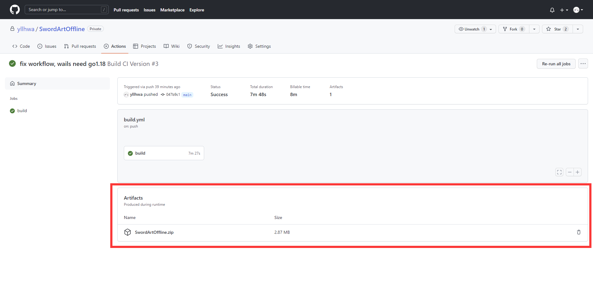

## 华中科技大学 网络空间安全学院 2020级 软件安全 课程设计

### 目录说明
1. demos  
   样本库
2. docs  
   文档
3. frontend  
   wails gui程序
4. HookLib  
   hook dll和注射器

### 二进制文件
已开启自动构建，在Actions中可以下载

### LICENSE
GPLV3  
请注意协议的限制